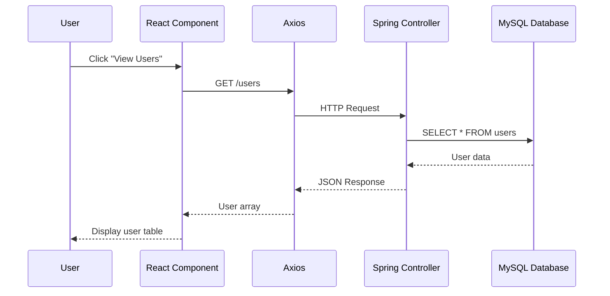

# Full Stack User Management System

A complete CRUD (Create, Read, Update, Delete) application built with **Spring Boot** backend and **React** frontend for managing user data.

## 🚀 Features

- **User Management**: Create, view, edit, and delete users
- **Responsive UI**: Built with Bootstrap for mobile-friendly design
- **RESTful API**: Clean REST endpoints for all CRUD operations
- **Database Integration**: MySQL database with JPA/Hibernate
- **Real-time Updates**: Instant UI updates after operations
- **Error Handling**: Custom exception handling and user feedback
- **Routing**: Client-side routing with React Router

## 🛠️ Tech Stack

### Backend

- **Spring Boot 3.5.6** - Main framework
- **Spring Data JPA** - Database abstraction layer
- **Spring Web** - REST API development
- **MySQL** - Database
- **Maven** - Dependency management
- **Java 17** - Programming language

### Frontend

- **React 19.2.0** - Frontend library
- **React Router DOM 7.9.3** - Client-side routing
- **Bootstrap 5.3.8** - UI framework
- **Axios 1.12.2** - HTTP client
- **JavaScript/JSX** - Programming language

## 📁 Project Structure

```
├── Backend (Spring Boot)
│   ├── src/main/java/com/ashutosh/backendapring3/
│   │   ├── controller/           # REST Controllers
│   │   │   └── UserController.java
│   │   ├── model/               # Entity Classes
│   │   │   └── User.java
│   │   ├── repository/          # Data Access Layer
│   │   │   └── UserRepository.java
│   │   ├── exception/           # Custom Exceptions
│   │   │   ├── UserNotFoundException.java
│   │   │   └── UserNotFoundAdvice.java
│   │   └── Backendapring3Application.java
│   ├── src/main/resources/
│   │   └── application.properties
│   └── pom.xml                  # Maven dependencies
│
├── Frontend (React)
│   ├── public/                  # Static files
│   ├── src/
│   │   ├── layout/              # Layout Components
│   │   │   └── Navbar.js
│   │   ├── pages/               # Page Components
│   │   │   └── Home.js
│   │   ├── users/               # User Management Components
│   │   │   ├── AddUsers.js
│   │   │   ├── EditUser.js
│   │   │   └── ViewUser.js
│   │   ├── App.js               # Main App Component
│   │   └── index.js             # Entry Point
│   └── package.json             # NPM dependencies
```

## 🏗️ Architecture

```mermaid
graph TB
    subgraph "Frontend (React - Port 3000)"
        A[Navbar Component] --> B[Home Page]
        A --> C[Add User]
        A --> D[Edit User]
        A --> E[View User]
        B --> F[User List Table]
        F --> G[Action Buttons]
    end

    subgraph "Backend (Spring Boot - Port 8080)"
        H[UserController] --> I[UserRepository]
        I --> J[(MySQL Database)]
        K[User Entity] --> I
        L[Exception Handler] --> H
    end

    subgraph "HTTP Communication"
        G --> |GET /users| H
        C --> |POST /user| H
        D --> |PUT /user/{id}| H
        G --> |DELETE /user/{id}| H
        E --> |GET /user/{id}| H
    end

    subgraph "Database Schema"
        J --> M[Users Table<br/>- id: Long<br/>- username: String<br/>- name: String<br/>- email: String]
    end

    style A fill:#61dafb
    style H fill:#6db33f
    style J fill:#00758f
```

## 🚦 API Endpoints

| Method | Endpoint     | Description       |
| ------ | ------------ | ----------------- |
| GET    | `/users`     | Get all users     |
| GET    | `/user/{id}` | Get user by ID    |
| POST   | `/user`      | Create new user   |
| PUT    | `/user/{id}` | Update user by ID |
| DELETE | `/user/{id}` | Delete user by ID |

## 📋 Prerequisites

Before running this application, make sure you have:

- **Java 17+** installed
- **Node.js 16+** and npm
- **MySQL** database server
- **Maven** (or use included Maven wrapper)

## 🚀 Getting Started

### 1. Clone the Repository

```bash
git clone https://github.com/ashutoshg-2005/Basic-CRUD-using-springboot-and-react.git
cd Basic-CRUD-using-springboot-and-react
```

### 2. Database Setup

```sql
-- Create database
CREATE DATABASE fullstack;

-- Create user (optional)
CREATE USER 'your_username'@'localhost' IDENTIFIED BY 'your_password';
GRANT ALL PRIVILEGES ON fullstack.* TO 'your_username'@'localhost';
```

### 3. Backend Configuration

Update `src/main/resources/application.properties`:

```properties
spring.datasource.url=jdbc:mysql://localhost:3306/fullstack
spring.datasource.username=your_username
spring.datasource.password=your_password
```

### 4. Run Backend

```bash
# Using Maven wrapper
./mvnw spring-boot:run

# Or using Maven
mvn spring-boot:run
```

Backend will start on `http://localhost:8080`

### 5. Run Frontend

```bash
# Install dependencies
npm install

# Start development server
npm start
```

Frontend will start on `http://localhost:3000`

## 🎯 Usage

1. **View Users**: Navigate to home page to see all users in a table
2. **Add User**: Click "Add User" button to create a new user
3. **View Details**: Click "View" button to see user details
4. **Edit User**: Click "Edit" button to modify user information
5. **Delete User**: Click "Delete" button to remove a user

## 🔧 Configuration

### Backend Configuration

- **Database**: Configure in `application.properties`
- **CORS**: Enabled for `http://localhost:3000`
- **Port**: Default Spring Boot port 8080

### Frontend Configuration

- **API Base URL**: `http://localhost:8080`
- **Development Port**: 3000
- **Build Output**: `build/` directory

## 🧪 Testing

### Backend Testing

```bash
mvn test
```

### Frontend Testing

```bash
npm test
```

## 📦 Build for Production

### Backend

```bash
mvn clean package
java -jar target/backendapring3-0.0.1-SNAPSHOT.jar
```

### Frontend

```bash
npm run build
```

## 🔄 How It Works

### Data Flow

1. **User Interaction**: User interacts with React components (buttons, forms)
2. **HTTP Requests**: Frontend sends HTTP requests to backend via Axios
3. **Controller Processing**: Spring Boot controller receives and processes requests
4. **Database Operations**: Repository layer performs CRUD operations on MySQL
5. **Response**: Data flows back through the same path to update the UI

### Component Interaction



## 📝 License

This project is open source and available under the [MIT License](LICENSE).

## 👨‍💻 Author

**Ashutosh** - [@ashutoshg-2005](https://github.com/ashutoshg-2005)
